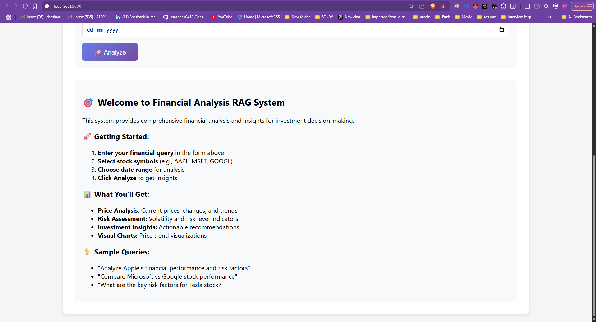
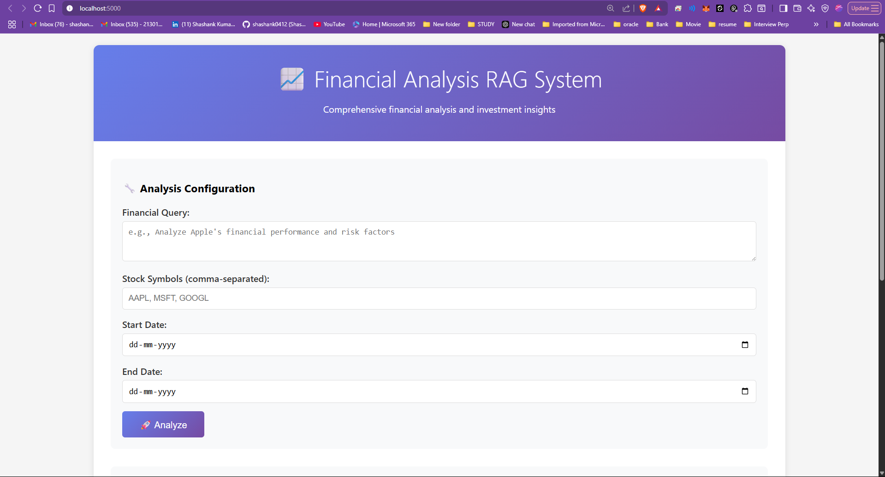

# Financial Analysis RAG System

A comprehensive Retrieval-Augmented Generation (RAG) system that combines financial reports, market data, and news to provide investment insights and risk assessments with temporal context and trend analysis.

## 🚀 Features

- **Multi-source Data Integration**: Combines financial reports, real-time market data, and news articles
- **Time-series Analysis**: Identifies trends and patterns in financial data over time
- **Investment Insights**: Generates actionable investment recommendations with risk assessments
- **Temporal Context**: Preserves and analyzes temporal relationships in financial data
- **Real-time Updates**: Incorporates live market data for current analysis
- **Risk Modeling**: Advanced risk assessment and volatility impact analysis

## 🏗️ Architecture

```
Financial Analysis RAG System
├── Data Sources
│   ├── Financial Reports (10-K, 10-Q, Annual Reports)
│   ├── Real-time Market Data (Yahoo Finance API)
│   ├── Financial News (NewsAPI)
│   └── Economic Indicators (FRED API)
├── Data Processing
│   ├── Text Chunking & Embedding
│   ├── Time-series Normalization
│   ├── Temporal Correlation Analysis
│   └── Risk Factor Extraction
├── Vector Database
│   ├── ChromaDB for Document Storage
│   ├── Temporal Indexing
│   └── Multi-modal Embeddings
└── RAG Pipeline
    ├── Context Retrieval
    ├── Temporal Context Fusion
    ├── Risk Assessment
    └── Insight Generation
```

## 🛠️ Technology Stack

- **Backend**: Python 3.9+
- **Vector Database**: ChromaDB
- **Embeddings**: OpenAI Ada-002 / Sentence Transformers
- **LLM**: OpenAI GPT-4 / Local Models
- **Data Sources**: Yahoo Finance, NewsAPI, FRED
- **Frontend**: Streamlit
- **Time-series**: Pandas, NumPy, TA-Lib
- **Risk Analysis**: SciPy, Scikit-learn

## 📦 Installation

1. **Clone the repository**
```bash
git clone <repository-url>
cd financial-analysis-rag
```

2. **Install dependencies**
```bash
pip install -r requirements.txt
```

3. **Set up environment variables**
```bash
cp .env.example .env
# Edit .env with your API keys
```

4. **Initialize the system**
```bash
python src/initialize_system.py
```

## 🔧 Configuration

Create a `.env` file with the following API keys:

```env
OPENAI_API_KEY=your_openai_api_key
NEWS_API_KEY=your_news_api_key
YAHOO_FINANCE_API_KEY=your_yahoo_api_key
FRED_API_KEY=your_fred_api_key
```

## 🚀 Usage

### Web Interface
```bash
streamlit run src/app.py
```

### Command Line Interface
```bash
python src/cli.py --query "Analyze Apple's financial performance and risk factors"
```

### API Endpoints
```bash
# Start the API server
uvicorn src.api:app --reload

# Query the system
curl -X POST "http://localhost:8000/analyze" \
  -H "Content-Type: application/json" \
  -d '{"query": "What are the key risk factors for Tesla stock?"}'
```

## 📊 Key Components

### 1. Data Ingestion Pipeline
- **Financial Reports**: Automated parsing of SEC filings
- **Market Data**: Real-time stock prices, volumes, and indicators
- **News Articles**: Financial news sentiment analysis
- **Economic Data**: Macroeconomic indicators and trends

### 2. Temporal Analysis Engine
- **Trend Identification**: Moving averages, momentum indicators
- **Seasonal Patterns**: Cyclical analysis and seasonal adjustments
- **Volatility Modeling**: GARCH models and risk metrics
- **Correlation Analysis**: Cross-asset and temporal correlations

### 3. Risk Assessment Module
- **Market Risk**: Beta, VaR, and volatility analysis
- **Credit Risk**: Financial ratios and credit metrics
- **Liquidity Risk**: Trading volume and bid-ask spreads
- **Regulatory Risk**: Compliance and legal factors

### 4. Insight Generation
- **Investment Recommendations**: Buy/sell/hold signals
- **Risk Warnings**: Potential threats and opportunities
- **Portfolio Optimization**: Asset allocation suggestions
- **Scenario Analysis**: What-if scenarios and stress testing

## 📈 Evaluation Metrics

- **Retrieval Accuracy**: Precision@K, Recall@K
- **Response Relevance**: RAGAS evaluation framework
- **Temporal Accuracy**: Time-series prediction accuracy
- **Risk Assessment**: Backtesting of risk predictions
- **Latency**: End-to-end response time

## 🔍 Example Queries

- "Analyze Apple's Q3 2024 financial performance and future outlook"
- "What are the key risk factors affecting Tesla's stock price?"
- "Compare the financial health of Microsoft vs Google"
- "Generate a risk assessment for the technology sector"
- "What market trends should I consider for portfolio optimization?"

## 📁 Project Structure

```
financial-analysis-rag/
├── src/
│   ├── data/
│   │   ├── collectors/
│   │   ├── processors/
│   │   └── storage/
│   ├── analysis/
│   │   ├── temporal/
│   │   ├── risk/
│   │   └── insights/
│   ├── rag/
│   │   ├── embeddings/
│   │   ├── retrieval/
│   │   └── generation/
│   ├── api/
│   ├── cli.py
│   ├── app.py
│   └── initialize_system.py
├── data/
│   ├── raw/
│   ├── processed/
│   └── embeddings/
├── tests/
├── docs/
├── requirements.txt
├── .env.example
└── README.md
```

# Financial Analysis RAG System

Comprehensive financial analysis and investment insights.

---

## Screenshots

### Analysis Configuration Page
<p align="center">
  
</p>

### Welcome & Features Page
<p align="center">
  
</p>


## 🤝 Contributing

1. Fork the repository
2. Create a feature branch
3. Make your changes
4. Add tests
5. Submit a pull request

## 📄 License

This project is licensed under the MIT License - see the LICENSE file for details.

## ⚠️ Disclaimer

This system is for educational and research purposes only. It does not constitute financial advice. Always consult with qualified financial professionals before making investment decisions.

## 🆘 Support

For questions and support, please open an issue on GitHub or contact the development team.
